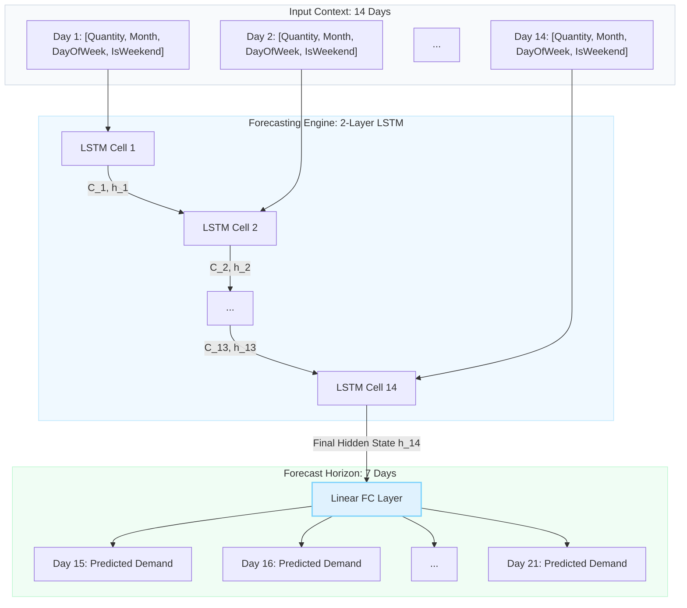

# Medication Demand Prediction and Restocking Recommendation API

An end-to-end predictive software service designed to forecast medication demand and generate automated inventory replenishment recommendations for pharmacies and hospitals. This system leverages deep learning (LSTM) for time-series forecasting, traditional operations research formulas for restocking optimization, and exposes functionality via a secure REST API (FastAPI) and interactive GUI dashboards (Tkinter).

Developed and configured for seamless execution inside **IntelliJ IDEA** or **PyCharm**.

---

## Project Functionality

1. **Secure Access**: Database-backed registration and API key lifecycle management using salted PBKDF2-SHA256 password hashing. All API requests are securely authenticated via custom HTTP headers (`X-API-Key`).
2. **Deep Learning Forecasting**: Predicts the daily consumption of individual medications for the next 7 days based on the past 14 days of historical records.
3. **Automated Restocking Decision Support**: Recommends restocking decisions (`true`/`false`) and computes order quantities by evaluating forecasted demand against current inventory levels, safety thresholds, and supplier lead times.
4. **Data Management**: Streamlined endpoints for uploading raw demand records, downloading processed training data directly in CSV format, and resetting models.
5. **Interactive Visualization**: Matplotlib-based Tkinter dashboards showing historical sales trends and comparing real-time forecasts directly with true consumer patterns.

---

## Engine Algorithms & Utilities

### 1. Forecasting Engine (LSTM Neural Network)
The forecasting system utilizes a **Long Short-Term Memory (LSTM)** recurrent neural network implemented in PyTorch (`MedicationDemandPredictor`).
* **Input Sequence**: 14 days of consecutive medication demand and temporal features (month, day of week, weekend indicator).
* **Forecast Horizon**: 7 days of future daily demand.
* **Architecture**: Unidirectional LSTM with 2 layers, 64 hidden units, and a linear output mapping layer.
* **Fine-Tuning support**: Supports incremental/continuous training on top of existing weights for continuous learning.
* **Feature Normalization**: Individual features are normalized to a `[0, 1]` range using a MinMax scaler to ensure gradient stability.



### 2. Restocking Recommendation Engine (ROP Model)
Restocking recommendations are calculated using a **Reorder Point (ROP)** model based on operations management formulas (`RestockingDecisionEngine`):
* **Demand During Lead Time (DDLT)**: Sum of forecasted demand over the lead time period:
  $$\text{DDLT} = \sum_{t=1}^{\text{lead\_time}} \text{Forecasted Demand}_t$$
* **Reorder Point (ROP)**: Threshold inventory level indicating when a new order must be placed:
  $$\text{ROP} = \text{DDLT} + \text{Safety Stock}$$
* **Restock Recommendation**: Triggered if the current stock falls below the ROP:
  $$\text{Restock} = \text{Current Inventory} \le \text{ROP}$$
* **Recommended Quantity**: The replenishment order volume required to restore safe inventory levels for the upcoming week:
  $$\text{Quantity} = \max\left(0, \text{Safety Stock} + \sum_{t=1}^{7} \text{Forecasted Demand}_t - \text{Current Inventory}\right)$$

---

## Data Source

The project uses real-world pharmacy demand records sourced from **Kaggle**:
* **Dataset Source Link**: [Hospital Medication Demand Dataset on Kaggle](https://www.kaggle.com/datasets/harrachimustapha/hospital-medication-demand)
* **Dataset File**: `Hospital Medication Demand.csv` (located in `resources/data/raw/`).
* **Format**: Relational schema containing 191,500 demand rows for 100 unique medications (`article_id`).
* **Features**: Each record maps an `article_id` to a specific `date` and its `total_quantity` consumed.

---

## Project Architecture

```text
C:/src/deep learning/
│
├── resources/                    # Storage for data files and trained binaries
│   ├── data/
│   │   ├── raw/                  # Contains raw CSV Kaggle dataset
│   │   ├── processed/            # Pipeline output (training_data.csv)
│   │   │   └── plots/
│   │   │       └── visualization.py  # Historical training data GUI Dashboard
│   │   └── process/              # Modular data cleaning & extraction package
│   └── models/                   # PyTorch weights (.pth) and fitted scalers (.pkl)
│
├── src/                          # Project source code
│   ├── enging/                   # Core predictive models & restocking math
│   │   ├── medication_demand_predictor.py
│   │   └── restocking_decision_engine.py
│   ├── rest api/                 # FastAPI service and DB schema
│   │   ├── database.py           # SQLite connection and user tables
│   │   ├── security.py           # PBKDF2 hashing and API key verification
│   │   ├── schemas.py            # Pydantic input/output schemas
│   │   └── main.py               # REST API endpoints and lifecycle
│   └── tryning/                  # GUI dashboards and local trainers
│       ├── time_series_dataset.py # sliding-window dataset formatter
│       ├── model_trainer.py      # Local script to train LSTM model
│       ├── model_comparator.py   # CLI comparison tool
│       └── model_comparison_gui.py # Forecast vs Real interactive GUI Dashboard
│
├── requirements.txt              # Project packages configuration
├── run_pipeline.py               # Preprocessing pipeline script
└── medication_demand.db          # Auto-generated SQLite user database
```

---

## Visualizations (GUI Dashboards)

The project includes two graphical user interfaces developed in **Tkinter** with embedded **Matplotlib** figures:

### 1. Training Data Visualizer
* **Location**: `resources/data/processed/plots/visualization.py`
* **Purpose**: Inspect historical demand trends for selected medication categories over Daily, Monthly, or Yearly resolutions. Includes interactive Date filtering.
* **Performance Optimization**: Automatically subsets large datasets in memory to prevent UI lag.

### 2. Forecast vs. Real Comparator Dashboard
* **Location**: `src/tryning/model_comparison_gui.py`
* **Purpose**: Compares actual historical consumption curves (shown as a muted, low-opacity line) with live LSTM forecasted demand (bold, solid line) on the same graph.
* **Dynamic Reloading**: Automatically re-reads the model weights (`medication_demand_lstm.pth`) and MinMaxScaler parameters (`scalers.pkl`) from disk when selecting articles.
* **Prediction Caching**: Caches predictions in memory. Adjusting dimensions (X/Y visual scales) in the settings modal or changing date intervals redraws plots instantaneously without triggering LSTM forward passes.

---

## REST API Documentation (FastAPI & Swagger UI)

FastAPI automatically hosts the interactive **Swagger UI** at `http://127.0.0.1:8000/docs`.

### Security & Access Control
All routes (except `/auth/*`) require authentication. Send your API key in the request headers:
```text
X-API-Key: <your_api_key_here>
```

### Key Endpoints

#### Authentication (Public)
* `POST /auth/register`: Create a user account (sends `email`, `full_name`, `password`) and receive a persistent `api_key`.
* `POST /auth/refresh-key`: Regenerate a new API key by sending user `email` and `password`.

#### Data Management (Secure)
* `GET /data/raw`: Download the full raw Kaggle CSV dataset sheet.
* `POST /data/raw/upload`: Append new records to the raw data sheet (validates columns: `article_id`, `date`, `total_quantity`).
* `GET /data/processed`: Download the engineered training CSV dataset.
* `POST /data/process`: Trigger the background processing pipeline to clean raw records and generate training files.
* `DELETE /data/processed`: Clear the processed training data.

#### Model Management & Training (Secure)
* `POST /model/train?epochs=5`: Trigger LSTM fine-tuning in a background thread for a number of epochs. Prints real-time losses in the console for each epoch.
* `GET /model/status`: Get background training job status, current epoch, and validation loss history.
* `GET /model/metrics`: Get historical model validation loss values.
* `DELETE /model`: Reset weights (random initialization) and scale parameters back to default states without removing files, ensuring GUIs start without error.

#### Predictions & Decisions (Secure)
* `POST /predict/demand`: Returns a 7-day predicted demand sequence formatted as integers (representing whole medication packages).
* `POST /predict/restock`: Computes 7-day demand predictions and passes them through the ROP model, returning restocking decision flags, reorder points, and recommended order quantities.

---

## How to Run the Project

### 1. Environment Setup & Dependencies
Open your terminal (PowerShell/CMD) in the project directory:

```powershell
# Create virtual environment
python -m venv .venv

# Activate virtual environment
# On Windows:
.venv\Scripts\activate
# On macOS/Linux:
source .venv/bin/activate

# Install required dependencies
pip install -r requirements.txt
```

### 2. Running in IntelliJ IDEA / PyCharm
The project is optimized for JetBrains IDEs:
1. Open the project root folder in **IntelliJ IDEA** (with the Python plugin) or **PyCharm**.
2. Go to `File -> Project Structure -> SDKs` and ensure the `.venv` virtual environment interpreter is selected.
3. To start the REST API:
   - Locate [main.py](file:///C:/src/deep%20learning/src/rest%20api/main.py) in the project tree (`src/rest api/main.py`).
   - Click the green **Run** arrow next to the `if __name__ == "__main__":` entry point or right-click the file and select **Run 'main'**.
4. To start the Comparison Dashboard:
   - Locate [model_comparison_gui.py](file:///C:/src/deep%20learning/src/tryning/model_comparison_gui.py).
   - Right-click the file and select **Run 'model_comparison_gui'**.
5. To start the Training Data Visualizer:
   - Locate [visualization.py](file:///C:/src/deep%20learning/resources/data/processed/plots/visualization.py).
   - Right-click the file and select **Run 'visualization'**.

### 3. Running from Command Line
Ensure your virtual environment is active:

```powershell
# Run the Data Preprocessing Pipeline (optional, to generate processed data)
python run_pipeline.py

# Run the FastAPI REST Server
cd "src/rest api"
python main.py

# Run the Comparison GUI Dashboard (in a separate terminal)
cd "src/tryning"
python model_comparison_gui.py

# Run the Training Data Visualizer GUI Dashboard (in a separate terminal)
cd "resources/data/processed/plots"
python visualization.py
```
